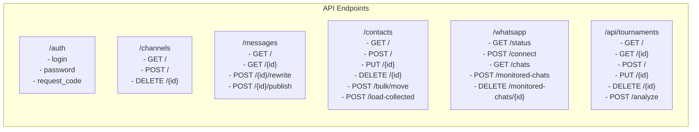
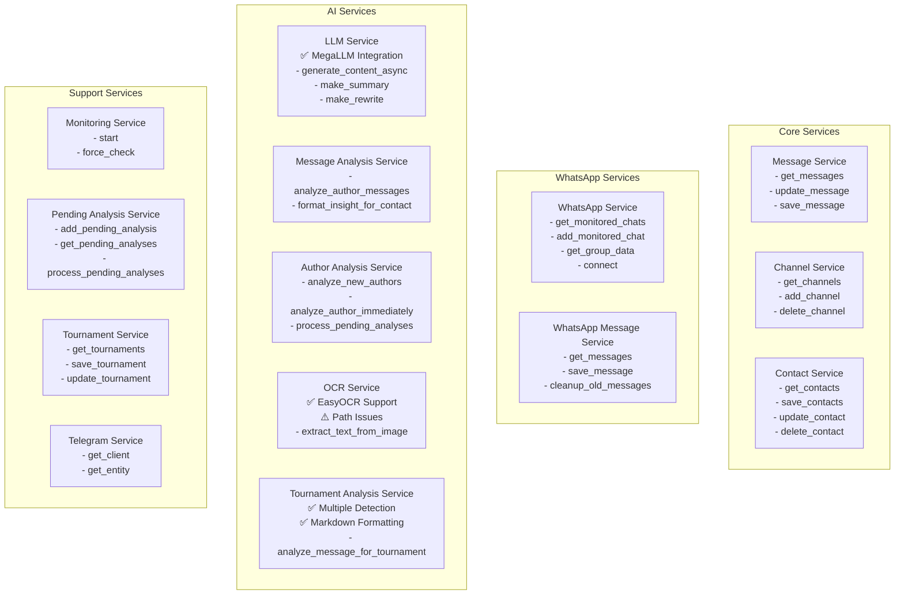
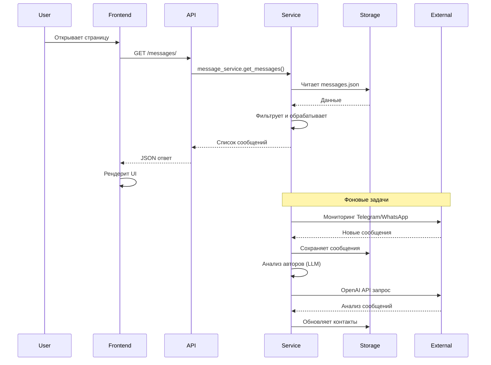
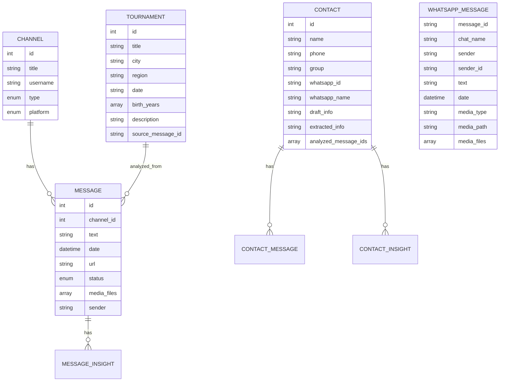
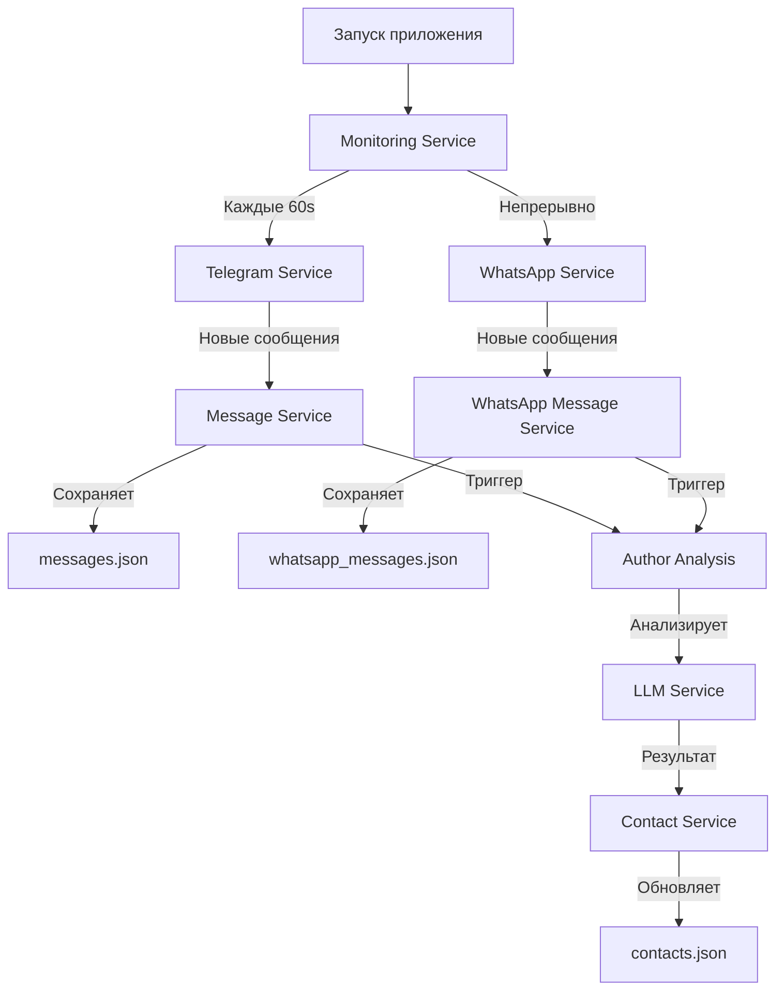
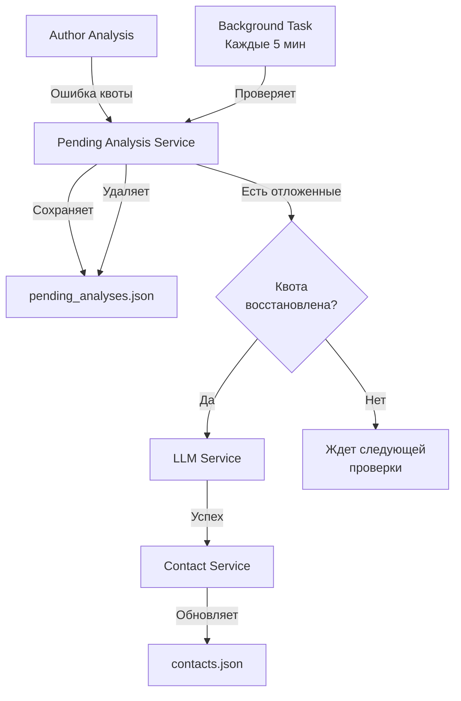
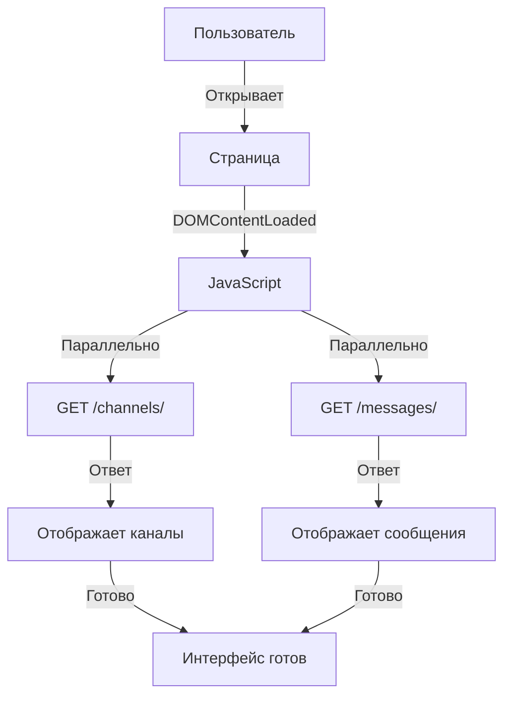
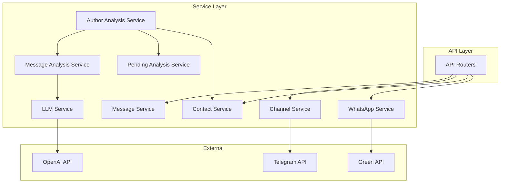

# Архитектура проекта "Телеграмм Мониторинг"

## 🎯 Текущий статус проекта (Декабрь 2025)

### ✅ Завершенные задачи:
1. **MegaLLM Integration** - Интеграция с MegaLLM API как основной LLM провайдер
2. **OCR Enhancement** - Добавлен EasyOCR как локальная альтернатива Vision API
3. **Tournament Analysis** - Автоматический анализ турниров с множественным обнаружением
4. **Markdown Formatting** - Красивое форматирование результатов анализа
5. **Multiple Tournament Detection** - ИИ определяет несколько турниров в одном сообщении

### 🔧 Текущие проблемы:
1. **OCR Service Issue** - OCR возвращает None для некоторых изображений
2. **HTTP 500 Error** - Ошибка "No text content found" при анализе турниров
3. **Path Encoding** - Проблемы с кириллическими символами в путях к файлам

### 🚀 Следующие шаги:
1. **Исправить OCR Service** - Отладить проблему с извлечением текста
2. **Улучшить обработку ошибок** - Добавить fallback механизмы
3. **Оптимизировать производительность** - Кэширование OCR результатов
4. **Расширить функциональность** - Добавить новые типы анализа

## Общая структура

```
Телеграмм Мониторинг
├── app/                    # Основное приложение
│   ├── api/                # API эндпоинты (FastAPI routers)
│   ├── services/           # Бизнес-логика и сервисы
│   ├── models/             # Pydantic модели данных
│   ├── core/               # Конфигурация и утилиты
│   ├── templates/          # HTML шаблоны (Jinja2)
│   ├── static/             # Статические файлы (JS, CSS, медиа)
│   └── utils/              # Вспомогательные утилиты
├── data/                   # JSON хранилище данных
└── session/                # Telegram сессии
```

## Архитектурная диаграмма

```mermaid
graph TB
    subgraph "Frontend Layer"
        UI[Web Interface<br/>Jinja2 Templates]
        JS[JavaScript Modules<br/>app.js, contact_enrichment.js, etc.]
        UI --> JS
    end

    subgraph "API Layer (FastAPI)"
        AUTH[Auth Router<br/>/auth]
        CHANNELS[Channels Router<br/>/channels]
        MESSAGES[Messages Router<br/>/messages]
        CONTACTS[Contacts Router<br/>/contacts]
        WHATSAPP[WhatsApp Router<br/>/whatsapp]
        TOURNAMENTS[Tournaments Router<br/>/api/tournaments]
        GROUPS[Groups Router<br/>/groups]
        GREEN_API[Green API Router<br/>/green-api]
        WEBHOOKS[Webhooks Router<br/>/webhooks]
        DASHBOARD[Dashboard Router<br/>/dashboard]
    end

    subgraph "Service Layer"
        MSG_SVC[Message Service]
        CHAN_SVC[Channel Service]
        CONT_SVC[Contact Service]
        WA_SVC[WhatsApp Service]
        WA_MSG_SVC[WhatsApp Message Service]
        LLM_SVC[LLM Service<br/>OpenAI API]
        MON_SVC[Monitoring Service]
        AUTH_SVC[Author Analysis Service]
        MSG_ANAL_SVC[Message Analysis Service]
        PENDING_SVC[Pending Analysis Service]
        OCR_SVC[OCR Service]
        TOUR_SVC[Tournament Service]
        TG_SVC[Telegram Service<br/>Telethon]
    end

    subgraph "External APIs"
        MEGALLM[MegaLLM API<br/>✅ Primary LLM<br/>llama3-8b-instruct]
        OPENAI[OpenAI API<br/>Fallback Vision]
        GEMINI[Gemini API<br/>Vision OCR<br/>⚠️ Quota Issues]
        TELEGRAM[Telegram API<br/>Telethon]
        GREEN_API_EXT[Green API<br/>WhatsApp]
        EASYOCR[EasyOCR<br/>✅ Local OCR<br/>No Quotas]
    end

    subgraph "Data Storage"
        JSON_FILES[JSON Files<br/>channels.json<br/>messages.json<br/>contacts.json<br/>whatsapp_messages.json<br/>tournaments.json]
    end

    subgraph "Background Tasks"
        MON_TASK[Monitoring Task<br/>Every 60s]
        AUTH_TASK[Author Analysis Task<br/>Every 5 min]
        WA_TASK[WhatsApp Monitoring<br/>Continuous]
    end

    %% Frontend to API
    JS -->|HTTP Requests| AUTH
    JS -->|HTTP Requests| CHANNELS
    JS -->|HTTP Requests| MESSAGES
    JS -->|HTTP Requests| CONTACTS
    JS -->|HTTP Requests| WHATSAPP
    JS -->|HTTP Requests| TOURNAMENTS
    JS -->|HTTP Requests| GROUPS

    %% API to Services
    AUTH --> TG_SVC
    CHANNELS --> CHAN_SVC
    CHANNELS --> WA_SVC
    MESSAGES --> MSG_SVC
    MESSAGES --> WA_MSG_SVC
    CONTACTS --> CONT_SVC
    WHATSAPP --> WA_SVC
    WHATSAPP --> WA_MSG_SVC
    TOURNAMENTS --> TOUR_SVC
    TOURNAMENTS --> LLM_SVC
    GROUPS --> WA_SVC

    %% Services to External APIs
    LLM_SVC --> MEGALLM
    LLM_SVC -.-> OPENAI
    TG_SVC --> TELEGRAM
    WA_SVC --> GREEN_API_EXT
    OCR_SVC --> EASYOCR
    OCR_SVC -.-> GEMINI
    OCR_SVC -.-> OPENAI
    TOUR_ANAL_SVC --> LLM_SVC
    TOUR_ANAL_SVC --> OCR_SVC

    %% Services to Data Storage
    MSG_SVC --> JSON_FILES
    CHAN_SVC --> JSON_FILES
    CONT_SVC --> JSON_FILES
    WA_MSG_SVC --> JSON_FILES
    TOUR_SVC --> JSON_FILES
    PENDING_SVC --> JSON_FILES

    %% Service Dependencies
    AUTH_SVC --> WA_MSG_SVC
    AUTH_SVC --> MSG_ANAL_SVC
    AUTH_SVC --> CONT_SVC
    AUTH_SVC --> PENDING_SVC
    MSG_ANAL_SVC --> LLM_SVC
    MSG_ANAL_SVC --> OCR_SVC
    MON_SVC --> MSG_SVC
    MON_SVC --> CHAN_SVC
    MON_SVC --> TG_SVC

    %% Background Tasks
    MON_TASK --> MON_SVC
    AUTH_TASK --> AUTH_SVC
    AUTH_TASK --> PENDING_SVC
    WA_TASK --> WA_SVC
    WA_TASK --> WA_MSG_SVC
    WA_TASK --> AUTH_SVC

    style UI fill:#e1f5ff
    style JS fill:#e1f5ff
    style OPENAI fill:#fff4e1
    style TELEGRAM fill:#fff4e1
    style GREEN_API_EXT fill:#fff4e1
    style JSON_FILES fill:#e8f5e9
    style LLM_SVC fill:#fce4ec
    style PENDING_SVC fill:#fce4ec
```



## Детальная архитектура компонентов

### 1. API Layer (FastAPI Routers)



### 2. Service Layer



### 3. Data Flow



### 4. Модели данных



## Технологический стек

### Backend
- **FastAPI** - веб-фреймворк
- **Telethon** - Telegram API клиент
- **Green API** - WhatsApp API
- **MegaLLM API** ✅ - основной LLM провайдер (llama3-8b-instruct)
- **OpenAI API** - резервный LLM и Vision API
- **Gemini API** - Vision OCR (с ограничениями квот)
- **EasyOCR** ✅ - локальное распознавание текста
- **Pydantic** - валидация данных
- **aiofiles** - асинхронная работа с файлами
- **Jinja2** - шаблонизация

### Frontend
- **HTML/CSS/JavaScript** - базовая веб-технология
- **Tailwind CSS** - стилизация (CDN)
- **Bootstrap 5** - UI компоненты
- **Chart.js** - графики
- **Marked.js** - Markdown парсинг
- **DOMPurify** - санитизация HTML

### Хранение данных
- **JSON файлы** - основное хранилище
  - `channels.json` - каналы Telegram
  - `messages.json` - сообщения Telegram
  - `whatsapp_messages.json` - сообщения WhatsApp
  - `contacts.json` - контакты
  - `tournaments.json` ✅ - турниры с множественным обнаружением
  - `monitored_chats.json` - мониторинг WhatsApp
  - `pending_analyses.json` - отложенные анализы
  - `llm_config.json` ✅ - конфигурация LLM провайдеров
  - `llm_keys.json` ✅ - управление API ключами

## Потоки данных

### 1. Мониторинг сообщений



### 2. Обработка отложенных анализов



### 3. Загрузка страницы



## Зависимости между модулями



## Основные функции системы

1. **Мониторинг каналов**
   - Telegram каналы через Telethon
   - WhatsApp группы через Green API
   - Автоматическое обновление каждые 60 секунд

2. **Анализ сообщений**
   - Извлечение информации об авторах
   - Анализ через MegaLLM API ✅
   - Обогащение контактов
   - OCR для изображений (EasyOCR + Vision APIs) ✅

3. **Управление контактами**
   - Автоматическое создание контактов
   - Группировка по категориям
   - Инсайты и черновики информации

4. **Анализ турниров** ✅
   - Автоматическое извлечение данных о турнирах
   - Множественное обнаружение турниров ✅
   - Определение региона по городу
   - Красивое Markdown форматирование ✅
   - Управление турнирами

5. **Отложенная обработка**
   - Сохранение анализов при исчерпании квоты
   - Автоматическая обработка после восстановления

6. **Управление LLM провайдерами** ✅
   - Поддержка множественных API ключей
   - Автоматическое переключение между провайдерами
   - Конфигурация моделей через админ панель

## Производительность

- **Оптимизация загрузки**: фильтрация данных до создания объектов
- **Параллельные запросы**: использование Promise.all для одновременной загрузки
- **Кэширование**: предотвращение дублирующих запросов
- **Пагинация**: курсорная пагинация для больших объемов данных

## Безопасность

- **HTML санитизация**: DOMPurify для предотвращения XSS
- **Валидация данных**: Pydantic модели
- **Аутентификация**: токены в localStorage
- **CSP**: Content Security Policy для скриптов

