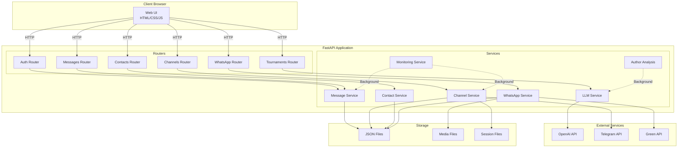
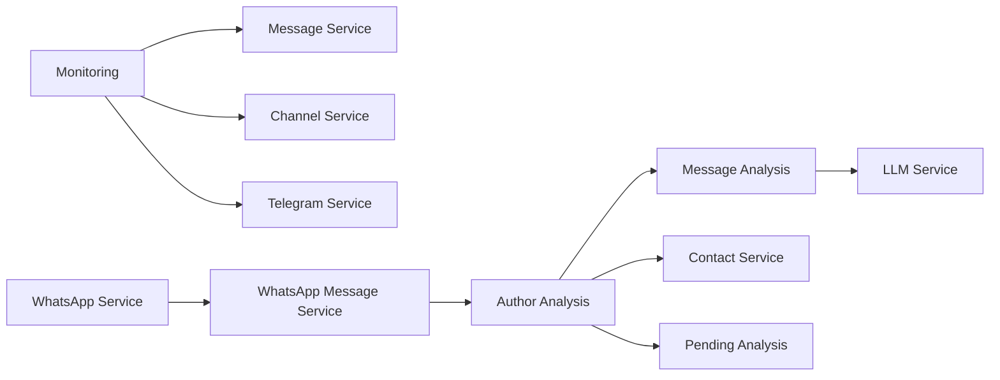

# Архитектура проекта - Интерактивная диаграмма

## Быстрый обзор

Проект представляет собой систему мониторинга и анализа сообщений из Telegram и WhatsApp с использованием AI для извлечения информации.

## Компоненты системы

### 1. Presentation Layer (Frontend)
- **Templates**: Jinja2 HTML шаблоны
- **JavaScript**: Модульная архитектура
  - `app.js` - основной функционал
  - `contact_enrichment.js` - обогащение контактов
  - `tournaments.js` - управление турнирами
  - `dashboard.js` - дашборд статистики

### 2. Application Layer (API)
- **FastAPI** роутеры для каждого домена:
  - `/auth` - аутентификация
  - `/channels` - управление каналами
  - `/messages` - работа с сообщениями
  - `/contacts` - управление контактами
  - `/whatsapp` - интеграция WhatsApp
  - `/api/tournaments` - управление турнирами
  - `/groups` - управление группами
  - `/green-api` - прокси для Green API
  - `/webhooks` - обработка webhooks

### 3. Business Logic Layer (Services)
- **Core Services**: работа с данными
- **AI Services**: анализ через LLM
- **Integration Services**: интеграция с внешними API
- **Background Services**: фоновые задачи

### 4. Data Layer
- **JSON файлы** для хранения данных
- **Session файлы** для Telegram
- **Media файлы** для медиа контента

## Визуализация архитектуры



## Детальная структура модулей

### API Routers → Services Mapping

| API Router | Основные Services | Функции |
|------------|------------------|---------|
| `/auth` | `telegram_service` | Аутентификация в Telegram |
| `/channels` | `channel_service`, `whatsapp_service` | Управление каналами |
| `/messages` | `message_service`, `whatsapp_message_service` | Получение и обработка сообщений |
| `/contacts` | `contact_service` | CRUD операции с контактами |
| `/whatsapp` | `whatsapp_service`, `whatsapp_message_service` | WhatsApp интеграция |
| `/api/tournaments` | `tournament_service`, `llm_service` | Управление турнирами |

### Service Dependencies



## Потоки обработки данных

### Поток 1: Мониторинг и анализ

```
Telegram/WhatsApp → Monitoring Service → Message Service → 
Author Analysis Service → Message Analysis Service → 
LLM Service (OpenAI) → Contact Service → Storage
```

### Поток 2: Отложенная обработка

```
Author Analysis → Quota Error → Pending Analysis Service → 
Storage (pending_analyses.json) → Background Task → 
Check Quota → Process Pending → Contact Service
```

### Поток 3: Загрузка страницы

```
User → Browser → FastAPI → API Routers → Services → 
JSON Storage → Response → Frontend Rendering
```

## Технические детали

### Асинхронность
- Все операции I/O асинхронные (async/await)
- Фоновые задачи через `asyncio.create_task`
- Параллельная загрузка данных через `Promise.all`

### Обработка ошибок
- Graceful degradation при ошибках API
- Сохранение отложенных анализов при ошибках квоты
- Retry логика для внешних API

### Масштабируемость
- Оптимизированная фильтрация данных
- Пагинация для больших объемов
- Ленивая загрузка контента

